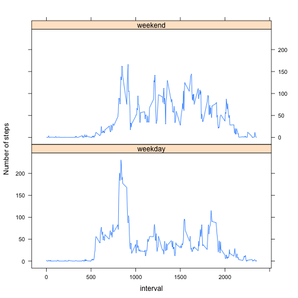

```r
library(knitr)
opts_chunk$set(fig.align='center')
opts_chunk$set(message=F)
options(scipen = 1, digits = 2)
```

## Loading and preprocessing the data

```r
library(dplyr)
act <- read.csv(unz('activity.zip', 'activity.csv'))
act <- tbl_df(act)
```


## What is mean total number of steps taken per day?

```r
by.date <- group_by(act, date)
daily_steps <- summarise(by.date, total_steps=sum(steps, na.rm=T))
hist(daily_steps$total_steps, breaks=20, xlab = 'Steps per day', main='Histogram of steps per day')
```


```r
mean_daily_steps <- mean(daily_steps$total_steps)
median_daily_steps <- median(daily_steps$total_steps)
```

The mean number of steps per day is 9354.23. The median number of steps per day is 10395.

## What is the average daily activity pattern?


```r
by.interval <- group_by(act, interval)
interval_steps <- summarise(by.interval, avg_steps=mean(steps, na.rm=T))
with(interval_steps, plot(x=interval, y=avg_steps, type="l", ylab="Average number of steps", xlab="Interval"))
```


```r
max_interval <- interval_steps[which(interval_steps$avg_steps == max(interval_steps$avg_steps)),'interval']
```

The interval with the highest average number of steps is 835.

## Imputing missing values


```r
missing_rows <- sum(is.na(act$steps))
```

There are 2304 missing values in the data set.

Create a new data set `act.imp` which replaces missing step data with the average number of steps for that interval across all days:


```r
library(sqldf)
interval_steps<-sqldf("
  select interval
  ,      avg(steps) as avg_steps
  from   act
  group by 1")
act.imp <- sqldf("
  select coalesce(act.steps, interval_steps.avg_steps) as steps
  ,      act.date
  ,      act.interval
  from   act
           join interval_steps on
             interval_steps.interval = act.interval")
```


```r
by.date <- group_by(act.imp, date)
daily_steps <- summarise(by.date, total_steps=sum(steps, na.rm=T))
hist(daily_steps$total_steps, breaks=20, xlab = 'Steps per day', main='Histogram of steps per day (imputed)')
```


```r
mean_daily_steps.imp <- mean(daily_steps$total_steps)
median_daily_steps.imp <- median(daily_steps$total_steps)
```

The mean number of steps per day is 10749.77. The median number of steps per day is 10641.


```r
comparison <- data.frame(Mean=c(mean_daily_steps, mean_daily_steps.imp),
                         Median=c(median_daily_steps, median_daily_steps.imp),
                         row.names=c("ignoring NAs", "imputed"))
kable(comparison)
```


|             |  Mean| Median|
|:------------|-----:|------:|
|ignoring NAs |  9354|  10395|
|imputed      | 10750|  10641|

Both the mean and median number of daily steps are higher if missing values are imputed.

## Are there differences in activity patterns between weekdays and weekends?

Create a new factor variable in the dataset with two levels -- "weekday" and "weekend" indicating whether a given date is a weekday or weekend day:

```r
act.imp$day <- ifelse(as.integer(strftime(as.Date(act.imp$date), "%u")) <= 5, "weekday", "weekend")
```

Compare number of steps averaged across all weekday or weekend days:


```r
library(lattice)
group_by(act.imp, interval, day) %>%
  summarize(avg_steps=mean(steps)) %>%
  xyplot(avg_steps ~ interval | day, data=.,
         layout=c(1,2),
         ylab="Number of steps",
         type="l")
```


This shows activity tends to start earlier on weekdays, but is flatter after about 0930, compared to weekends, which show a more even spread of activity across the day.
